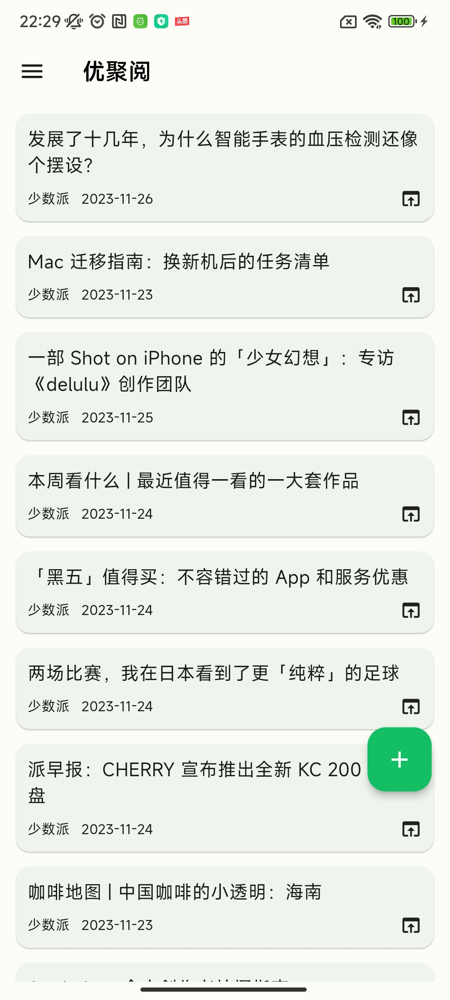
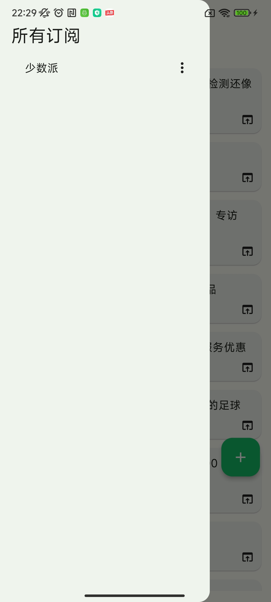
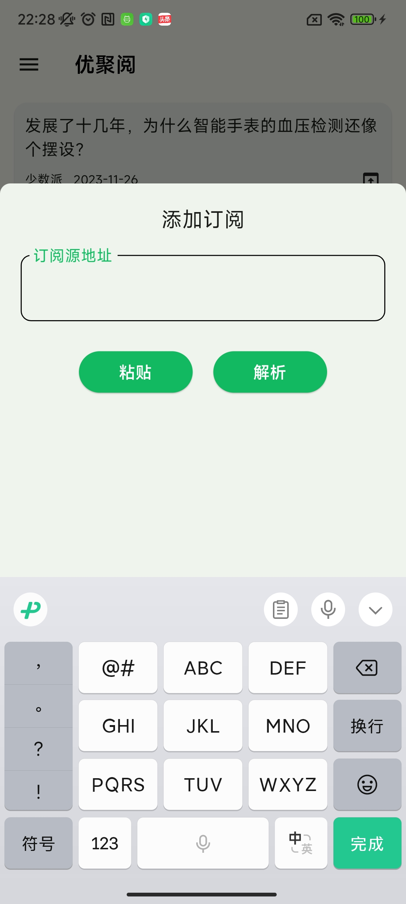
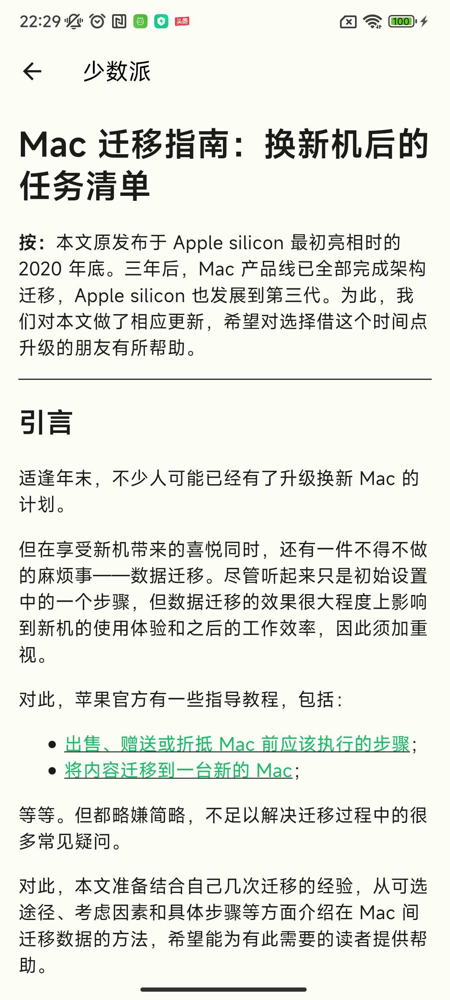

<!-- 
<a href="Juyoyue.md">简体中文</a> 
 | English -->

<h1>JUYOYUE 聚优阅</h1>

<strong>简易的 RSS 阅读器，使用 <a href='https://flutter.dev' target='_blank'>Flutter</a> 构建和 <a href='https://m3.material.io/' target='_blank'>Material You</a> 设计</strong>

## 说明
- [✓] 订阅源添加、删除
- [✓] 自动获取全文在应用内阅读
- [✓] 可选择跳转到浏览器阅读

目前刚开始，其它功能正在建设中......

